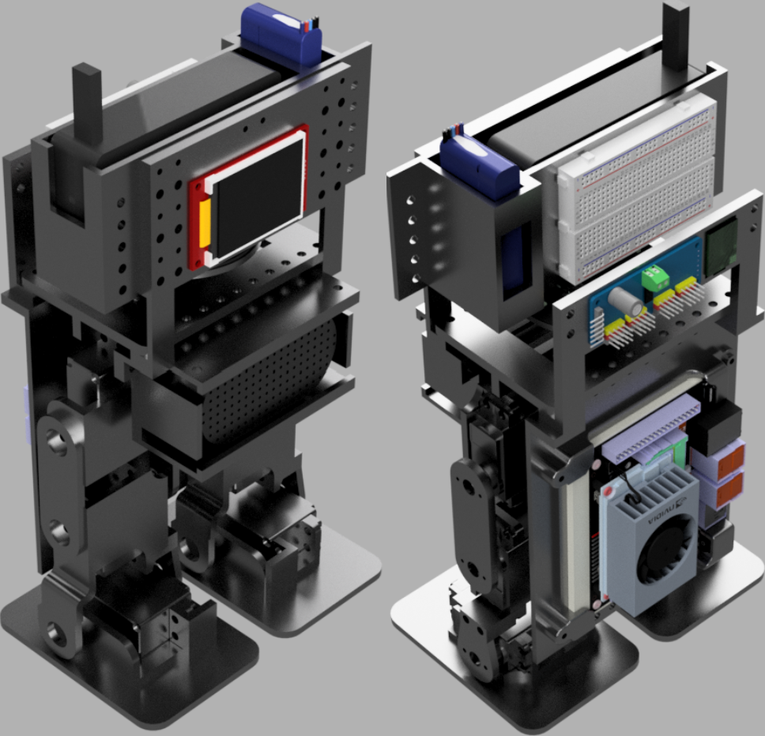
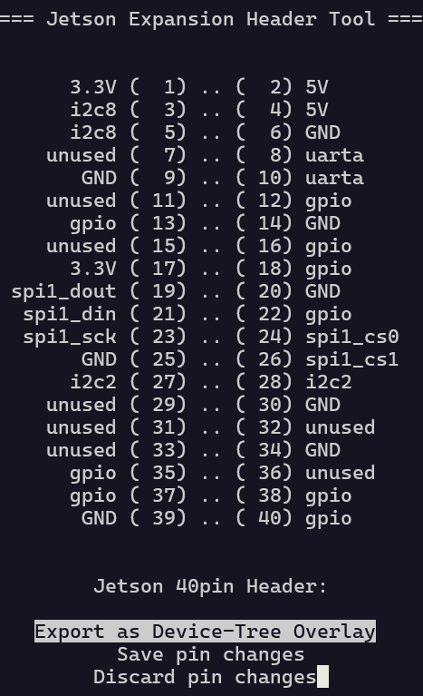

# Uzi


Uzi from Murder Drones, but in real life (with less murdering).

Modules:

- Speech to text: sherpa-onnx with the sherpa-onnx-streaming-zipformer-en-kroko-2025-08-06 model on CPU
- Agent: OpenRouter with DeepSeek v4 Flash, Uzi prompt/tools
- Walking: Hard-coded (WIP)
- Text to speech: Fish Audio S2-Pro using [Uzi Doorman (murder drones)](https://fish.audio/m/dbfcbb173fb84528ac4ccaf446026277/)
- Display: Very basic lip-syncing

## CAD

Uzi v0.1: See the `.step` and `.f3z` in the `cad` folder.



## Assembly

(Warning: These instructions are very likely incomplete. The servos are slightly incorrectly sized, as they were not the ones used in the instructable, but it is still assemblable. Also, this robot does not balance well due to being heavy with weak-ish servos. I would not recommend attempting to re-build this without edits to help with balancing/walking.)

Start with the assembly and materials needed from [this instructable](https://www.instructables.com/Arduino-Controlled-Robotic-Biped/). Differences: Uzi has larger foot plates on the bottom, and the electronics mount has been replaced with a bigger mount. Do not assemble the head mount for now.

Print parts from the CAD.

Then, assemble the ReSpeaker microphone mount and attach it to the servo body.

Then, assemble the head mounted portion on its own. Don't connect it to the servo body yet.

Finally, screw the head mounted portion to the servo body / microphone mount.

Refer to the CAD and videos for details.

In addition to the materials needed from the instructable, you'll need roughly:

- 4x M2.5 ~16mm screws
- 8x M2.5 ~10mm, maybe flat-head screws
- 12x M2.5 nuts
- 16x 0-80 small screws and nuts
- A bunch of M4 screws/nuts

## Wiring

See [the Jetson manual](https://developer.nvidia.com/embedded/downloads#?search=Jetson%20Orin%20Nano%20Developer%20Kit%20Carrier%20Board%20Specification) and [JetsonHacks](https://jetsonhacks.com/nvidia-jetson-orin-nano-gpio-header-pinout/) for the Jetson pinout.

Connect the ReSpeaker mic and USB speaker to the Jetson via USB. Note that the ReSpeaker mic needs a (not included) micro USB to USB cable.

Power bank -> PD trigger cable set to 12 V -> Jetson power port.

Buck converter: LiPo battery to PCA9685, set such that 8.4 V -> ~5.8 V. (This makes 7.6 -> 6.37 V on my setup, which is marginally close enough to the 4.8 - 6 V operating range of the FS5103B servo). I wired this up to a switch.

Servos to PCA9685:

- Right ankle: 11
- Right knee: 10
- Right hip: 9
- Left ankle: 4
- Left knee: 5
- Left hip: 6

BNO085 to Jetson (UART-RVC): VIN and P0 to 3.3 V, GND to GND, SCL to UART1_TXD, SDA to UART1_RXD.

TFT to Jetson: VIN to 3.3 V, GND to GND, SCK to SPI0_SCK, MOSI to SPI0_MOSI, MISO to SPI0_MISO, TCS to SPI0_CS0, DC to some GPIO (pin 18), RST to some GPIO (pin 16).

LED to some GPIO (pin 35).

## Jetson Setup

Setup the Jetson Orin Nano Developer Kit by following [this](https://developer.nvidia.com/embedded/learn/get-started-jetson-orin-nano-devkit#firmware). Note that you need a (not included) MicroSD card, ideally at least 128 GB with UHS-1 speed or higher.

- Firmware should be >= 36.5.0 with JetPack 6.2.1. It will be running Ubuntu 22.
- The SD card slot is in the middle of the fan and the bottom of the board. It should snap into place.

Upgrade to JetPack 6.2.2 by following [this](https://forums.developer.nvidia.com/t/jetpack-6-2-2-jetson-linux-36-5-is-now-live/359622). Check that the package source list matches this:

```
deb https://repo.download.nvidia.com/jetson/common r36.5 main
deb https://repo.download.nvidia.com/jetson/t234 r36.5 main
deb https://repo.download.nvidia.com/jetson/ffmpeg r36.5 main
deb https://repo.download.nvidia.com/jetson/rt-kernel r36.5 main
```

NOTE: The below script, compiled during the dev process, has not been tested directly. Expect to run into some issues.

Run this from the root of the repo:

```sh
echo "Setting up Jetson..."
sudo apt-get update
sudo apt-get upgrade

# Install realtime kernel
sudo apt install nvidia-l4t-rt-kernel nvidia-l4t-rt-kernel-headers nvidia-l4t-rt-kernel-oot-modules nvidia-l4t-display-rt-kernel

# Downgrade to an older Snap version to allow apps to install (see https://forums.developer.nvidia.com/t/chromium-other-browsers-not-working-after-flashing-or-updating-heres-why-and-quick-fix/338891)
snap download snapd --revision=24724
sudo snap ack snapd_24724.assert
sudo snap install snapd_24724.snap
sudo sudo snap refresh --hold snapd

# Install Chromium
sudo apt-get install -y chromium-browser

# Packages and tools
sudo apt-get install -y fzf htop software-properties-common portaudio19-dev minicom fonts-dejavu
echo 'source /usr/share/doc/fzf/examples/key-bindings.bash' >> ~/.bashrc  # Ctrl-R history fuzzy search

# Remote VNC server (remote desktop)
sudo apt-get install -y tigervnc-standalone-server
gsettings set org.gnome.desktop.screensaver lock-enabled false  # Fixes remote perma-lock bug
# Run over SSH: vncserver :1 -geometry 1920x1080 -depth 24 -localhost no
# Stop it later: vncserver -kill :1
# Connect: vnc://192.168.55.1:5901 (or the IP shown with ifconfig)

# Set microphone input source to ReSpeaker mic
pactl set-default-source alsa_input.usb-SEEED_ReSpeaker_4_Mic_Array__UAC1.0_-00.multichannel-input

# Install helper tools
sudo snap install zellij --classic  # Zellij
curl -LsSf https://astral.sh/uv/install.sh | sh  # uv

# Install Tailscale
curl -fsSL https://tailscale.com/install.sh | sh
sudo tailscale up
# Also install Tailscale on your local machine
# Then you can SSH / setup remote VS Code using Tailscale's assigned IP/domain name

# Perms for Jetson pins
sudo usermod -aG i2c,gpio,dialout uzi

# Perms for the ReSpeaker mic array
sudo tee /etc/udev/rules.d/99-respeaker-tuning.rules >/dev/null <<'EOF'
SUBSYSTEM=="usb", ATTR{idVendor}=="2886", ATTR{idProduct}=="0018", MODE="0666"
EOF
sudo udevadm control --reload-rules
sudo udevadm trigger

# Pipewire stack install (replaces PulseAudio)
sudo apt remove pulseaudio
sudo apt install pipewire-pulse wireplumber pipewire-audio-client-libraries pulseaudio-utils
systemctl --user daemon-reload
systemctl --user --now enable wireplumber pipewire-pulse
systemctl --user restart pipewire
pactl info

# Setup uv venv
uv sync

# Build sherap-onnx for CPU (https://k2-fsa.github.io/sherpa/onnx/install/linux.html#cpu-linux-x64-or-linux-arm64)
git clone https://github.com/k2-fsa/sherpa-onnx lib/sherpa-onnx
cd lib/sherpa-onnx
mkdir build
cd build
cmake -DCMAKE_BUILD_TYPE=Release ..
make -j6
cd ../../..

# Get STT model
ARCHIVE=sherpa-onnx-streaming-zipformer-en-kroko-2025-08-06.tar.bz2 && mkdir -p models && wget -q -O "models/$ARCHIVE" "https://github.com/k2-fsa/sherpa-onnx/releases/download/asr-models/$ARCHIVE" && tar xjf "models/$ARCHIVE" -C models && rm "models/$ARCHIVE"

# Setup systemd service
sudo cp uzi-robot.service /etc/systemd/system/uzi-robot.service
sudo systemctl daemon-reload  # Reloads the config .service file
# sudo systemctl [enable/disable] --now uzi-robot.service: Changes the service to run/stop now/on startup.

echo "Setup complete! Note: Need to manually configure pins in jetson-io. See README.md."
```

These pins need to be explicitly configured, ex: as GPIO, for them to work. Run this, edit the header manually, and match the text to the shown pins:



```sh
sudo /opt/nvidia/jetson-io/jetson-io.py
# Set pins 16, 18, and 35 to GPIO, enable I2C, SPI1, and UART, save and reboot
```

## Run

NOTE: You'll need OpenRouter and Fish Audio API keys:

- [https://openrouter.ai/](https://openrouter.ai/) (Pay-as-you-go, can expect the cost to be very small, under 50 cents for playing around though)
- [https://fish.audio/app/api-keys/](https://fish.audio/app/api-keys/) (Students can get free credit)

Make a `.env` file at the repo root with:

```text
OPENROUTER_API_KEY=<Your API key>
FISH_API_KEY=<Your API key>
```

The setup script installs a systemd service that runs while the Jetson is on, auto-starting Uzi.

Disable/enable auto-start:
```sh
sudo systemctl [enable/disable] --now uzi-robot.service
```

Start Uzi manually (without the systemd service):
```
uv run src/main.py
```